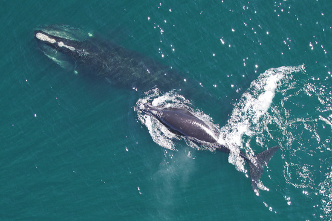

# NARW 

[Last of the Right Whales](https://lastoftherightwhales.com)

[whale entanglement](https://www.andersoncabotcenterforoceanlife.org/blog/scenes-from-a-right-whale-entanglement)

[another film - Entangled](https://entangled-film.com/)

## what 

[North American Right Whale - Eubalaena glacialis](https://www.fisheries.noaa.gov/species/north-atlantic-right-whale)

[Whale Anatomy](https://oceantoday.noaa.gov/whaleanatomy/welcome.html)

[Human Connections](https://ocean.si.edu/ocean-life/marine-mammals/north-atlantic-right-whale)

## whoi
* whales http://rwcatalog.neaq.org/#/whales
* [Snow Cone](https://www.fisheries.noaa.gov/feature-story/snow-cone-watch-updates-entangled-right-whale-mother-and-newborn-calf)
* [scientists (including citizens)](https://www.whoi.edu/know-your-ocean/ocean-topics/ocean-life/right-whales/)
* management- multi-level
* fishing 
 * whalers 
 * lobster and crab fishers
 * others (lines, nets)
* shipping

## where / when  
   https://whalemap.ocean.dal.ca/#map

## why

[A Risk Analysis of Entanglement](https://storymaps.arcgis.com/stories/efb2e1d058054fb6a1487d964397bffd)

["Unusual Mortality"](https://www.fisheries.noaa.gov/national/marine-life-distress/2017-2022-north-atlantic-right-whale-unusual-mortality-event)

## how 

[science, regulation, and technology](https://www.fisheries.noaa.gov/search?oq=north+american+right+whale)

[AI for whale id from photos](https://www.fisheries.noaa.gov/new-england-mid-atlantic/science-data/artificial-intelligence-right-whale-photo-identification) https://conbio.onlinelibrary.wiley.com/doi/10.1111/cobi.13226 

### and how [gory](https://github.com/robibok/whales) [details](https://blog.deepsense.ai/deep-learning-right-whale-recognition-kaggle/)

* ROVs - acoustic detection of whales
* season limits -
* speed limits - slow down when right whales are seen
* weak rope and ropeless aka on-call fishing gear

 * [weak rope - breaks](https://www.mass.gov/doc/12422-dmf-offering-free-buoy-line-marking-materials-and-additional-free-weak-rope/download)
    
 * [early ropeless technology](https://www.whoi.edu/oceanus/feature/whale-safe-fishing-gear/)

 * [ongoing technology testing](https://www.mass.gov/service-details/ropeless-fishing-gear-feasibility-study)

  * [SMELTS](https://www.smelts.org/)

  * [EdgeTech](https://www.edgetech.com/)

 * [challenges](https://capecodfishermen.org/item/aidsropelesshear-0127?category_id=9)

  * [Pioneers for a Thoughtful Co-Existence](https://www.capeandislands.org/local-news/2022-01-13/lobsterman-v-lobsterman-fight-over-ropeless-fishing-divides-industry)
